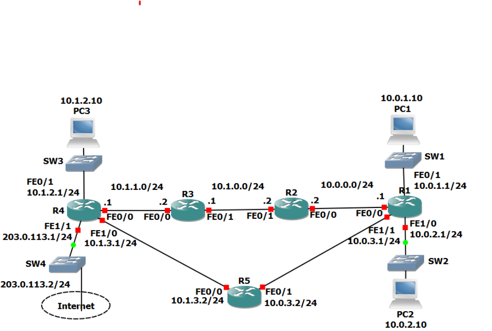

# 📂 Lab : Fondamentaux du Routage (CCNA) 🚀

## 🎯 Pourquoi ce lab ?
En tant qu'étudiant en **Cybersécurité**, on apprend vite qu'on ne peut pas protéger un réseau qu'on ne sait pas faire communiquer. Ce projet est ma base : comprendre comment les données circulent, comment optimiser les chemins et surtout, comment garantir que le réseau reste disponible même quand un lien tombe.

**Ce que j'ai voulu démontrer :**
* Ma capacité à configurer une infrastructure Cisco de A à Z.
* Ma compréhension de la "logique" interne d'un routeur (pourquoi il choisit tel chemin plutôt qu'un autre).
* L'importance de la redondance pour éviter les coupures de service.

---

## 🗺️ La Topologie
C'est ici que tout se passe. Une architecture avec 5 routeurs qui simule un réseau d'entreprise avec ses accès utilisateurs et sa sortie vers Internet.

<p align="center">
  
</p>

---

## 🛠️ Ce que j'ai mis en place

### 1. Faire le ménage avec les "Summary Routes"
Plutôt que de saturer mon routeur **R1** avec des dizaines de routes pour chaque petit segment, j'ai utilisé la **summarization**. En une seule ligne, j'ai englobé tout le bloc `10.1.0.0/16`. 
* **Le but :** Un routeur plus rapide, une table de routage plus propre et moins de charge CPU.
```bash
R1(config)# ip route 10.1.0.0 255.255.0.0 10.0.0.2
```

### 2. Le Load Balancing : Ne jamais dépendre d'un seul lien
En cyber, la disponibilité est une priorité (le "D" de la triade CIA). J'ai configuré deux routes par défaut sur **R1** pour sortir vers Internet. Si le lien via **R2** sature ou tombe, le trafic peut passer par **R5**. 
* **Résultat :** Le trafic est réparti et le réseau est beaucoup plus résilient.
```bash
R1(config)# ip route 0.0.0.0 0.0.0.0 10.0.0.2
R1(config)# ip route 0.0.0.0 0.0.0.0 10.0.3.2
```

### 3. Longest Prefix Match : Le "cerveau" du routeur
C'est le concept le plus intéressant. J'ai pu vérifier que le routeur est "intelligent" : même si une route globale existe, il choisira toujours la plus précise. En configurant une route spécifique vers `10.1.3.0/24`, j'ai forcé le trafic vers PC3 à prendre un chemin précis, prouvant que la précision l'emporte sur la globalité.

---

## 🛡️ Cyber : L'asymétrie des flux
Un point qui m'a marqué dans ce lab, c'est que le chemin aller n'est pas forcément le chemin retour. Un paquet peut sortir par **R2** et revenir par **R5**. 
* **Leçon apprise :** C'est un cauchemar pour un Firewall qui ne verrait qu'une moitié de la conversation ! Comprendre ça, c'est essentiel pour savoir où placer ses équipements de sécurité.

---

## 🔍 Comment j'ai validé tout ça ?
Pas de configuration sans vérification !
* **Pings & Traceroute :** Pour confirmer que PC1 parle à PC3 et voir exactement par où passent les paquets.
* **Analyse de table :** Un petit `show ip route` pour m'assurer que mes routes statiques et ma "Gateway of last resort" sont bien en place.
```
